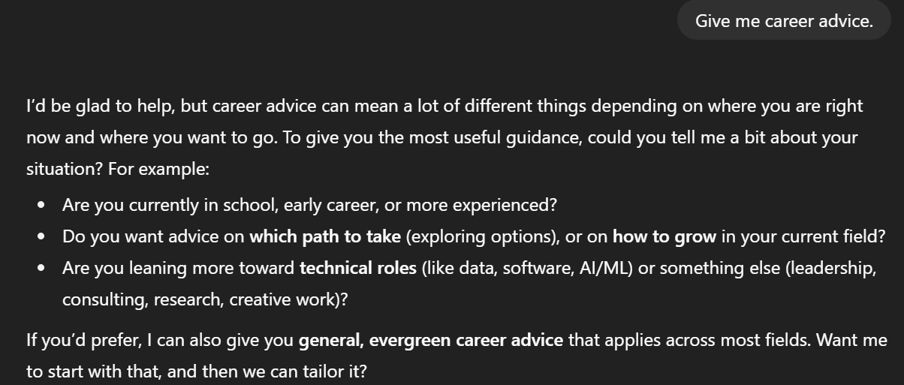
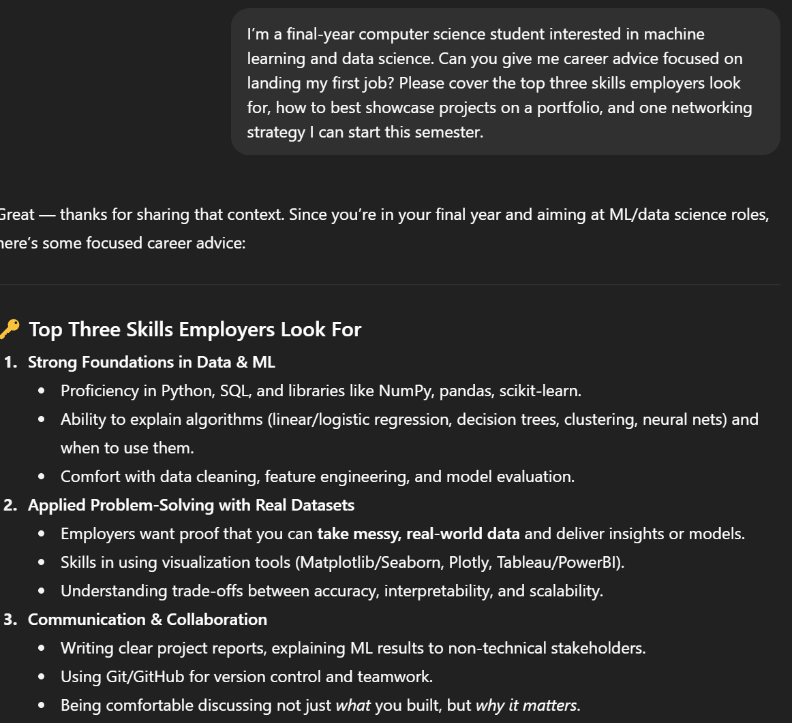
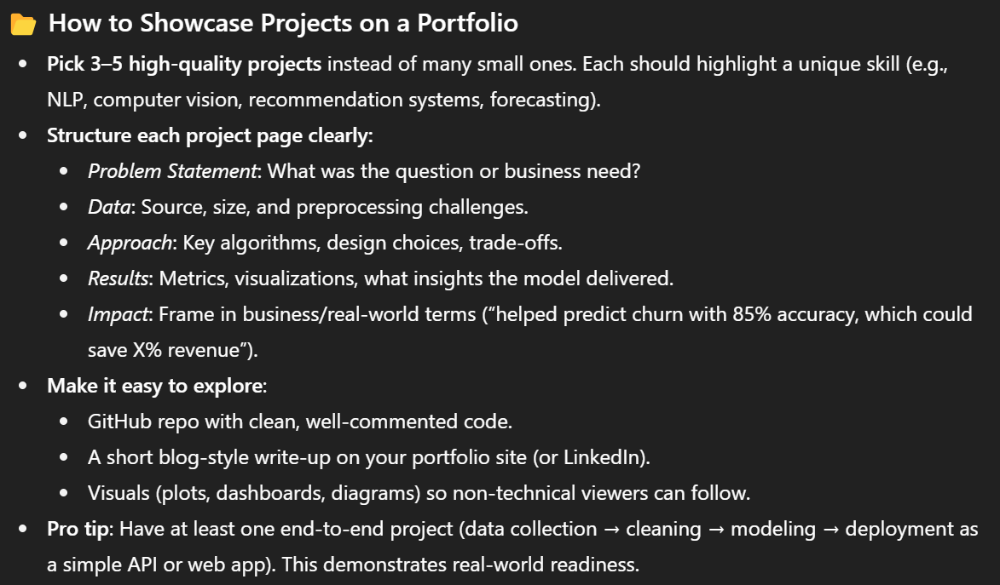
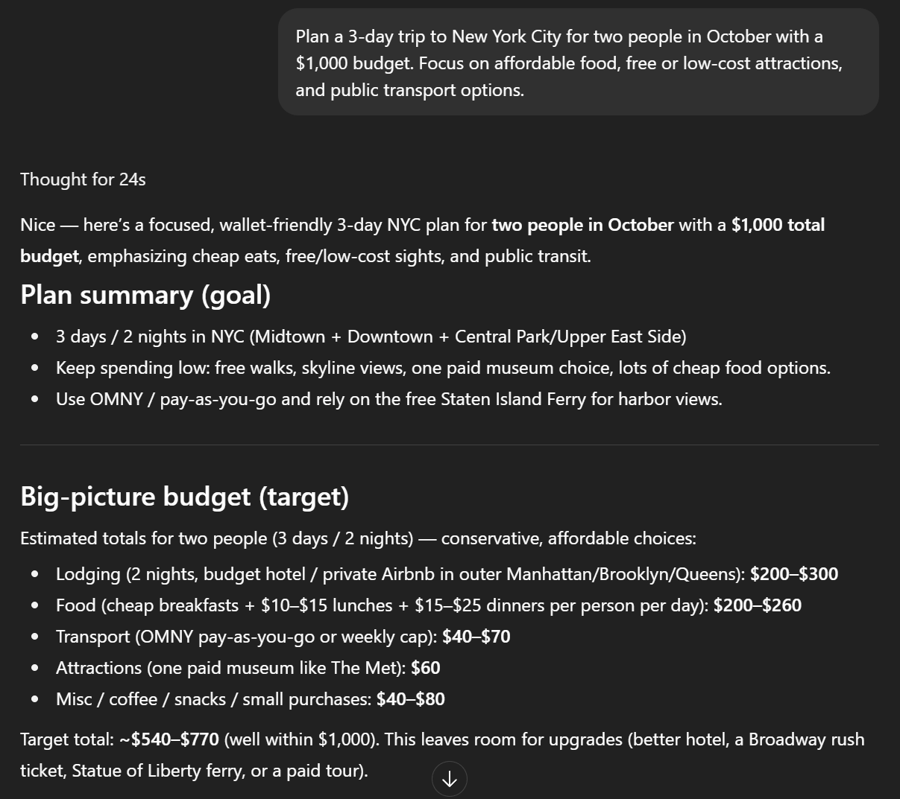
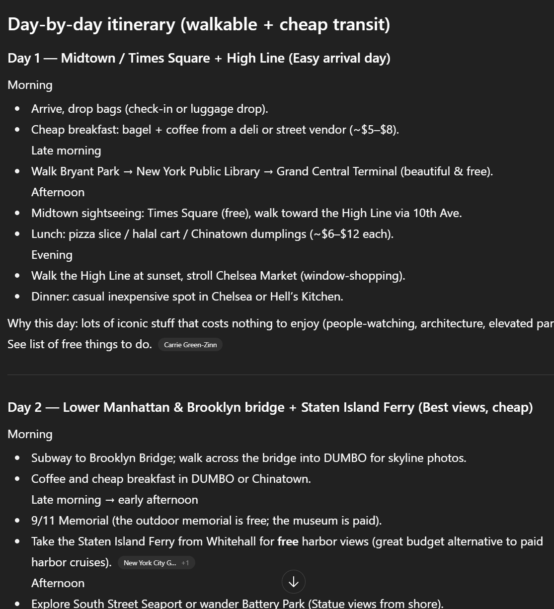
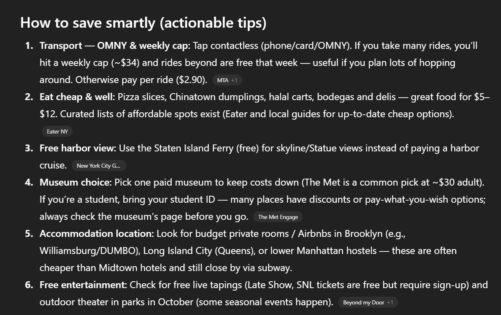
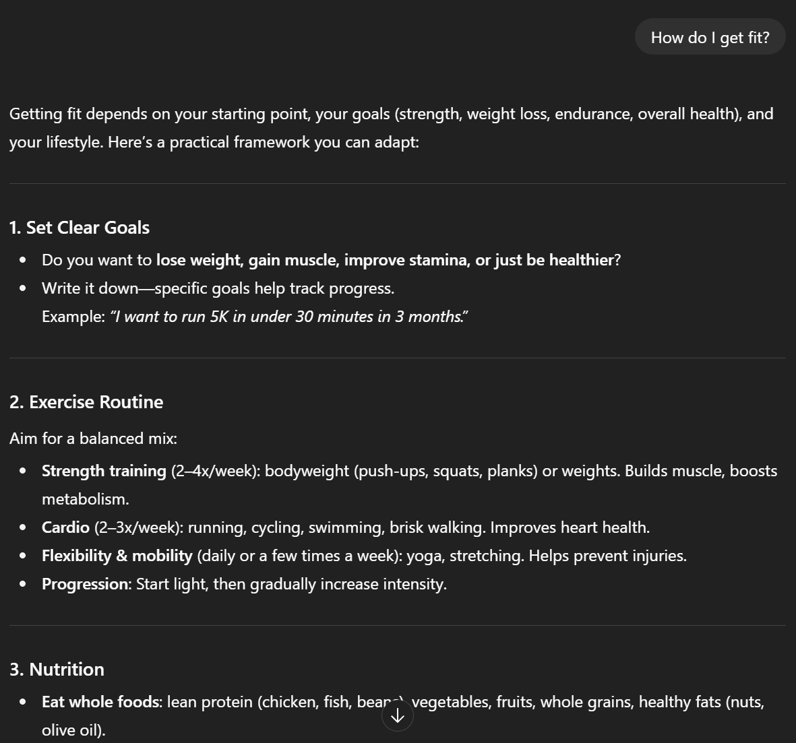
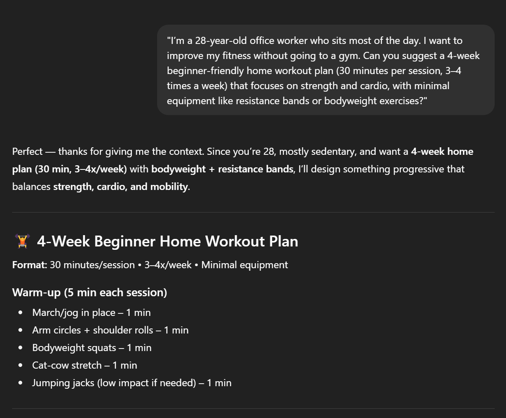
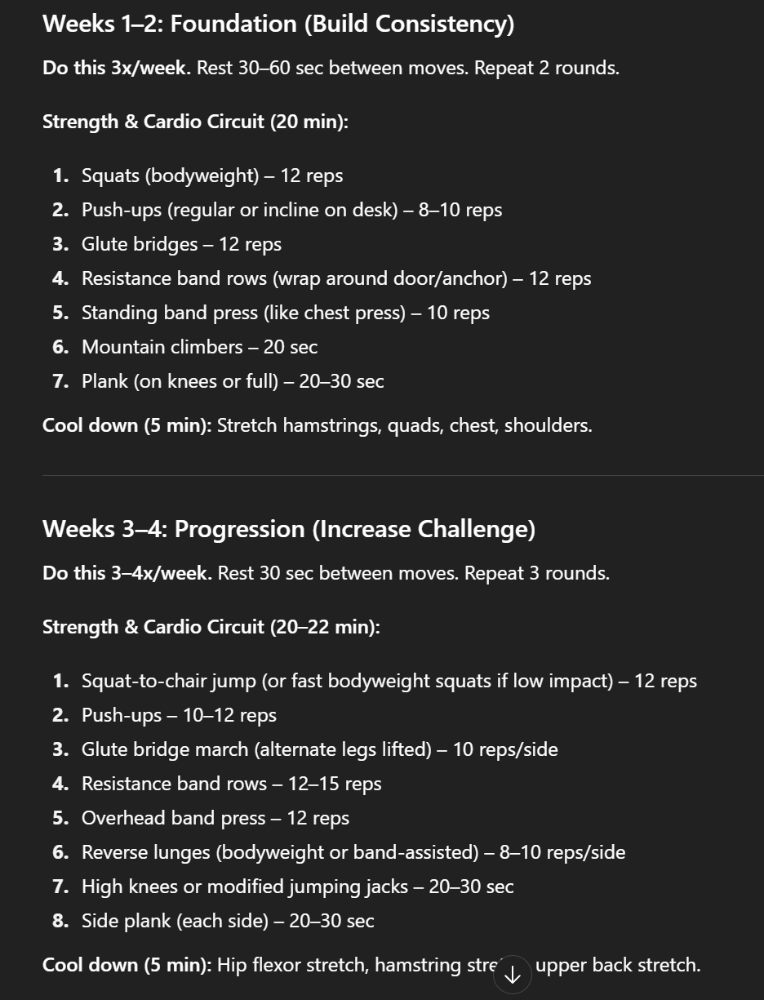

# Concept Exploration

# The Secret Sauce of Talking to AI: Effective Communication

If you’ve ever yelled at your phone because it “didn’t get it,” you already know this truth: machines don’t magically understand us — we have to learn how to talk to them. That’s where **Effective Communication** in Botspeak comes in. It’s not about using fancy technical terms or coding. Instead, it’s about being **clear, simple, and intentional** in how we guide AI. Think of it less like programming and more like giving directions to a friend who’s new in town: the more context and clarity you give, the smoother the journey.

**Effective Communication** in the **BOTSPEAK** framework means giving an AI system clear, precise, and purposeful instructions so that it understands not only what to do, but also why it matters. It is the bridge between human intent and machine output, ensuring that ideas are translated into useful, reliable results. Without effective communication, even the most powerful AI becomes like a smart assistant who misheard the task — busy, but not helpful.

---

## A Philosophical Backbone: From Descartes to Popper

This idea has deep roots in philosophy.

- **René Descartes** believed in clarity and distinctness as the foundation of true knowledge. In a way, effective communication with AI is very Cartesian: if our instructions are fuzzy, the output will be, too.

- **David Hume** reminded us that humans often leap from cause to effect without certainty. With AI, the same caution applies: just because we phrase something one way doesn’t guarantee the machine interprets it as we expect.

- **Karl Popper** emphasized the power of testing ideas through trial and error. That’s exactly what effective communication looks like with AI — you refine prompts, test responses, and keep improving until the results are useful.

So, when we practice effective communication with AI, we’re not just typing words into a box — we’re standing in a long line of thinkers who cared deeply about how humans express ideas and uncover truth.

---

## Where It Fits in the Botspeak Loop

Within the Botspeak framework, **Effective Communication** is the **“Direct”** step of the loop. First, you **define** the problem. Then, you **delegate** which parts AI should handle. And right before the machine goes to work, you **direct** it — that’s where effective communication shines. Without clear direction, the rest of the loop collapses. It’s like setting a GPS but forgetting to type in the destination — you’ll go somewhere, but probably not where you wanted.

In short: **Effective communication is the hinge between human intention and machine output**.

---

## Purpose and Significance — Why Effective Communication Matters

Effective Communication is the single most important factor in whether human-AI collaboration succeeds or fails. AI systems don’t “understand” in the human sense; they rely entirely on the clarity of the instructions we give them. Without clear communication, even the most advanced AI will drift, misinterpret, or produce vague results.

This makes Effective Communication critical because:

- It ensures humans stay in control of the interaction by clearly setting goals, boundaries, and expectations.
- It reduces errors and misunderstandings, which in high-stakes settings (like medicine or finance) can protect safety and prevent costly mistakes.
- It transforms AI from a novelty into a reliable, everyday partner by making its outputs useful, structured, and aligned with human needs.

In short, Effective Communication is not just about writing better prompts — it is about creating a shared language where humans provide intent, and AI translates that intent into meaningful action. It’s the glue that makes collaboration possible.

---

### Impact on reliability, safety, and usefulness

**Reliability** — the AI does what you expect.

- When instructions include context, format, and tests, outputs become repeatable.
- **Example:** Asking for “a three-bullet summary with dates” makes the AI produce a consistent, testable result. If you don’t specify format or constraints, the AI guesses — and guesses can vary wildly.
- **Practical effect:** Clear prompts reduce errors and make it easier to spot when the AI is wrong.

**Safety** — the AI avoids harmful mistakes.

- Good communication includes guardrails: what not to do, what sensitive data to ignore, and what to flag.
- **Example:** In healthcare or legal contexts, instruct the AI to avoid making clinical or legal judgments and to highlight uncertain claims for human review. If neglected: the AI might invent facts, reveal sensitive info, or make unsafe recommendations.
- **Practical effect:** Adding explicit safety instructions prevents misuse and keeps humans responsible for risky decisions.

**Usefulness** — the output is actually helpful.

- Useful AI output is specific, actionable, and aligned with user goals.
- **Example:** Instead of “summarize this,” say “summarize for a busy manager in five bullet points with next-step recommendations”. If neglected: outputs may be vague, unfocused, or unusable — good-looking text that doesn’t solve the problem.
- **Practical effect:** Clear communication turns raw AI creativity into work you can act on immediately.

---

### Quick implementation checklist (what to include in every prompt)

- **Goal:** What do you want the AI to accomplish?
- **Audience & tone:** Who will use the output and how should it sound?
- **Format & length:** Bullets, paragraph, table, word limit, etc.
- **Constraints & safety:** What to avoid and when to escalate to a human.
- **Acceptance test:** One or two checks you’ll run to confirm it’s correct.

---

## Effective Communication in Action: Two Career Advice Prompts

### Prompt 1: The Vague Request

- **Instruction given:**
  > “Give me career advice.”
- **AI’s response:** The AI hesitates and asks clarifying questions. It doesn’t give concrete advice because it doesn’t know your situation, goals, or constraints.
- 👉 **Why this happened:** The human communication was too broad. “Career advice” could mean high school, early career, midlife pivot, or leadership coaching. The AI was forced to “guess” — and wisely, it didn’t commit.
- 👉 **Lesson:** Without effective communication, you waste time on back-and-forth clarifications. The AI can’t read your mind.

### Prompt 2: The Clear, Detailed Request

- **Instruction given:**
  > “I’m a final-year computer science student interested in machine learning and data science. Can you give me career advice focused on landing my first job? Please cover the top three skills employers look for, how to best showcase projects on a portfolio, and one networking strategy I can start this semester.”
- **AI’s response:** The AI delivers a structured, targeted answer with three skill areas, portfolio advice, and a networking plan. It even offers a next step (a six-month plan).
- 👉 **Why this worked:** The human gave:
  - **Context** (final-year CS student, ML/Data focus)
  - **Goal** (landing first job)
  - **Format** (top 3 skills, portfolio, networking strategy)
  - **Constraints** (focused on job-readiness, not general advice)
- The AI had a clear “map” of what was needed, so it could generate a useful, actionable answer.
- 👉 **Lesson:** With effective communication, the AI becomes a partner who delivers high-value, ready-to-use output.

---

### Side-by-Side Comparison

| Factor         | Prompt 1                             | Prompt 2                                      |
| :------------- | :----------------------------------- | :-------------------------------------------- |
| **Clarity**    | Vague (“career advice”)              | "Precise (student, ML focus, job search)"     |
| **Context**    | Missing                              | Provided (final-year CS student)              |
| **Format**     | Not specified                        | "Structured: 3 skills, portfolio, networking" |
| **AI Output**  | "General, hesitant, needs more info" | "Detailed, actionable, professional-quality"  |
| **Time Saved** | Low (more clarifications needed)     | High (ready-to-use plan)                      |

---

### Big Takeaway

The same AI, with the same abilities, produced **two completely different levels of value**. The difference wasn’t the AI — it was the human’s communication. Effective Communication turns AI from a “question deflector” into a “career coach”.

---

## Effective Communication in Action: Travel Planning

### Prompt 1: The Broad Request

- **Instruction given:**
  > “Plan me a trip to USA.”
- **AI’s response:** A generic “greatest hits” itinerary: New York, D.C., Vegas, San Francisco, Los Angeles. Plus some broad travel tips and rough cost ranges.
- 👉 **Why this happened:** The request was too wide. “Plan me a trip to the USA” is like saying “Tell me about food in the world”. The U.S. is massive, with endless travel styles (luxury vs. budget, city vs. nature, solo vs. group). With no guidance, the AI defaulted to the most famous spots and basic tips.
- 👉 **Lesson:** Vague inputs = broad, unfocused outputs. You’ll still get something, but it won’t be tailored to your needs.

### Prompt 2: The Detailed Request

- **Instruction given:**
  > “Plan a 3-day trip to New York City for two people in October with a $1,000 budget. Focus on affordable food, free or low-cost attractions, and public transport options.”
- **AI’s response:** A structured, **budget-conscious 3-day plan**:
  - Lodging options with price estimates
  - Cost breakdown by category (food, transport, attractions)
  - Free/cheap activities like Central Park, Staten Island Ferry, High Line
  - Day-by-day itinerary, including meal suggestions
  - Practical booking tips and money-saving hacks
- 👉 **Why this worked:** The human gave:
  - **Destination & timeframe** (NYC, 3 days in October)
  - **Audience** (two people)
  - **Budget constraint** ($1,000 cap)
  - **Priorities** (affordable food, free attractions, public transport)
- With these clear constraints, the AI produced a tailored plan that could realistically be used to book the trip — not just inspiration, but execution.
- 👉 **Lesson:** Specific, detailed communication turns AI into a **personal travel agent** instead of a generic guidebook.

---

### Side-by-Side

| Factor         | Prompt 1                            | Prompt 2                                               |
| :------------- | :---------------------------------- | :----------------------------------------------------- |
| **Clarity**    | “Plan me a trip to USA” (too broad) | "NYC, 3 days, 2 people, October, $1,000, budget focus" |
| **Context**    | Missing                             | "Provided (who, when, where, budget)"                  |
| **Output**     | Generic sightseeing list            | "Detailed, budget-specific itinerary + cost breakdown" |
| **Usefulness** | Low — just inspiration              | "High — actionable, bookable plan"                     |
| **Time Saved** | Minimal (user must still research)  | Maximum (ready-to-use plan with budget tracking)       |

---

### Big Takeaway

Both prompts used the **same AI**, but only one got a **real travel plan**. The difference wasn’t in the AI’s intelligence — it was in the human’s communication. Effective Communication makes the AI practical. Without it, you just get a brochure; with it, you get a travel guide tailored to your life.

---

## Effective Communication in Action: Two Fitness Prompts

### Prompt 1: The Vague Request

- **Instruction given:**
  > “How do I get fit?”
- **AI’s response:** The AI provides a broad framework — set goals, exercise, eat well, sleep, manage stress. It’s useful as a primer but not personalized.
- 👉 **Why this happened:** The human communication was too broad. “Get fit” could mean weight loss, muscle gain, running a marathon, or just better health. The AI had to guess what mattered most.
- 👉 **Lesson:** Without context or constraints, the AI defaults to general advice — informative, but not directly actionable.

---

### Prompt 2: The Clear, Detailed Request

- **Instruction given:**
  > “I’m a 28-year-old office worker who sits most of the day. I want to improve my fitness without going to a gym. Can you suggest a 4-week beginner-friendly home workout plan (30 minutes per session, 3–4 times a week) that focuses on strength and cardio, with minimal equipment like resistance bands or bodyweight exercises?”
- **AI’s response:** The AI delivers a **structured 4-week workout plan** — with warm-ups, circuits, cool downs, week-by-week progression, and minimal equipment. It’s tailored to the lifestyle (sedentary office worker), time limits (30 min), and constraints (no gym).
- 👉 **Why this worked:** The human gave:

  - **Context** (28-year-old sedentary office worker)
  - **Goal** (improve fitness at home)
  - **Constraints** (no gym, minimal equipment, 30 min, 3–4x/week)
  - **Format** (4-week progressive plan)

- The AI had a clear “map” to follow and delivered a ready-to-use workout.
- 👉 **Lesson:** With effective communication, the AI can transform from a “fitness explainer” into a “personal trainer.”

---

### Side-by-Side Comparison

| Factor         | Prompt 1                    | Prompt 2                                      |
| :------------- | :-------------------------- | :-------------------------------------------- |
| **Clarity**    | Vague (“How do I get fit?”) | Precise (age, lifestyle, goals, equipment)    |
| **Context**    | Missing                     | Provided (sedentary office worker)            |
| **Format**     | Not specified               | Structured: 4-week plan with progression      |
| **AI Output**  | General framework           | Detailed, actionable, personalized program    |
| **Time Saved** | Low (needs tailoring later) | High (ready-to-use, no extra planning needed) |

---

### Big Takeaway

The same AI produced **two very different outputs**.

- Vague input → vague framework.
- Clear, detailed input → concrete, personalized action plan.
- The AI didn’t “fail” here — it was blocked by a lack of human input.
  👉 When you neglect effective communication, AI can’t act as a coach, guide, or planner. It’s reduced to a polite question machine.

👉 **Effective communication turns AI from a “general advisor” into a “personal coach.”**

---

# In other words: **Garbage in, Garbage out.**

### References

Berger, C. R. (2005). Interpersonal communication: Theoretical perspectives, future prospects. _Journal of Communication, 55_(3), 415–447. [https://doi.org/10.1111/j.1460-2466.2005.tb02680.x](https://doi.org/10.1111/j.1460-2466.2005.tb02680.x)

Brownlee, J. (2021). _Better prompt engineering: Guidelines for effective AI communication_. Machine Learning Mastery. [https://machinelearningmastery.com/prompt-engineering](https://machinelearningmastery.com/prompt-engineering)

Cialdini, R. B. (2007). _Influence: The psychology of persuasion_ (Rev. ed.). Harper Business.

Grice, H. P. (1975). Logic and conversation. In P. Cole & J. L. Morgan (Eds.), _Syntax and semantics_ (Vol. 3, pp. 41–58). Academic Press.

OpenAI. (2023). _Best practices for prompt engineering with large language models_. [https://platform.openai.com/docs/guides/prompting](https://platform.openai.com/docs/guides/prompting)

Vygotsky, L. S. (1978). _Mind in society: The development of higher psychological processes_. Harvard University Press.

---
